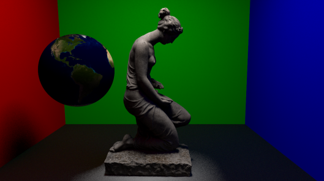
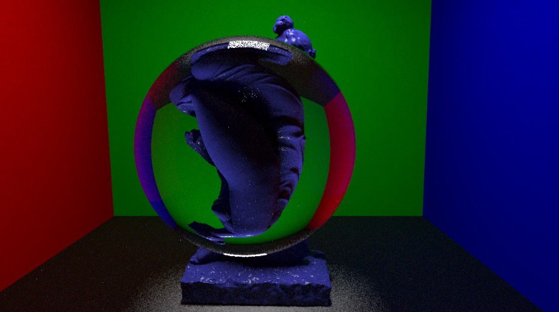
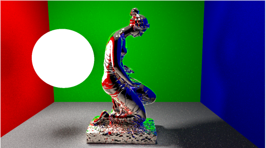
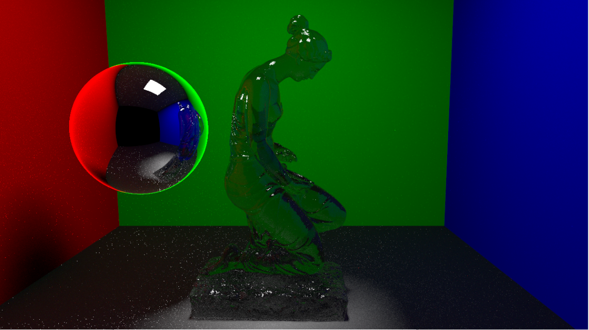

# High-Performance C++ Path Tracer

A physically based, multithreaded CPU path tracer written in C++. Originally inspired by Peter Shirley's *Ray Tracing in One Weekend* series, this engine has been heavily expanded and refactored from the ground up to support complex 3D triangle meshes, advanced BSDF materials, and highly optimized acceleration structures.

<p align="center">
  
  
  
  
</p>

## 🚀 Core Features

### Architecture & Performance
* **Multithreaded Rendering:** Fully utilizes modern multi-core CPUs to tile and distribute rendering workloads efficiently.
* **High-Performance Geometry:** Engineered specifically for complex mesh rendering. Capable of processing and rendering high-poly models (500,000+ triangles) in under a minute.
* **Bounding Volume Hierarchy (BVH):** Implements a highly optimized BVH tree for fast spatial querying and ray-primitive intersection testing.
* **Surface Area Heuristic (SAH):** Uses SAH for intelligent BVH node splitting, drastically reducing rendering times by minimizing bounding box overlap and intersection checks.

### Light & Global Illumination
* **Path Tracing:** Simulates true global illumination, realistic shadows, color bleeding, and accurate light bouncing.
* **Multiple Importance Sampling (MIS):** Combines BRDF sampling and direct light sampling to dramatically reduce variance (noise) in scenes with complex lighting.
* **Russian Roulette:** An unbiased path termination algorithm that stops calculating rays that contribute little to the final image, significantly speeding up render times for deep light bounces.
* **Advanced Sampling:** Utilizes robust sampling techniques to converge on clean images faster.

### Materials & Shading (BSDF)
The engine features a robust Bidirectional Scattering Distribution Function (BSDF) framework supporting physically based materials:
* **Microfacet (GGX):** For realistic rough metals and glossy surfaces.
* **Dielectrics (Glass):** Physically accurate refraction, reflection, and Snell's law calculations.
* **Mirror/Perfect Metal:** Flawless reflection with configurable fuzziness.
* **Lambertian (Diffuse):** Standard diffuse materials with accurate cosine-weighted light scattering.
* **Emissive:** Area light generation for glowing objects and light sources.

### Asset Pipeline
* **OBJ Loading:** Seamless integration with `tinyobjloader` to load complex 3D models and their associated material data.
* **Texture Mapping:** Full support for image-based textures (JPG supported), including diffuse maps and albedo texturing.

---

## 🛠️ Building and Running

### Prerequisites
* **C++17** (or higher) compatible compiler
* **CMake** (version 3.10 or higher)
* *Windows/Visual Studio 2022 recommended for the current build environment.*

### 1. Clone and Build
Open your developer command prompt and run:

```developer command prompt
# Navigate into the CMake project folder
cd CMakeProject3

# Create build environment
mkdir build
cd build

# Generate and Build the Release executable
cmake ..
cmake --build . --config Release
2. Run the Renderer
CRITICAL: You must run the executable from the project's root directory so the engine can locate the models/ directory for OBJ and texture files.

Developer Command Prompt:
# Move back to the root directory
cd ../..

# Run the engine and output the result to a PPM image
.\CMakeProject3\build\Release\CMakeProject3.exe > image.ppm
3. Viewing the Output (.ppm)
The engine outputs the final render in the Netpbm color image format (.ppm). Standard default image viewers cannot open this file type natively. To view your generated image.ppm, you will need one of the following:

Image Editing Software: Programs like GIMP or Adobe Photoshop.

Dedicated Image Viewers: Lightweight viewers like IrfanView or XnView.

VS Code Extensions: If you are using Visual Studio Code, install extensions like PBM/PPM/PGM Viewer to see the image directly in your editor.

Online Converters: Use any free online "PPM to PNG" converter to change it into a standard web-friendly format.

📂 Project Directory Structure
To ensure the asset pipeline works correctly, keep your models in the root directory as shown below:

Ray-Tracing-Cpp/
├── CMakeProject3/          # Source code, headers, and CMakeLists.txt
│   └── build/              # Compiled binaries (generated here)
├── models/                 # Place your .obj, .mtl, and .jpg files here
│   ├── rabbit.obj
│   └── earthmap.jpg
├── screenshots/            # Gallery of final renders
└── README.md
🙏 Acknowledgements
Peter Shirley: For the phenomenal Ray Tracing in One Weekend series that served as the mathematical foundation for this project.

tinyobjloader: For parsing Wavefront OBJ files efficiently.

jbikker: For the excellent BVH-SAH series.